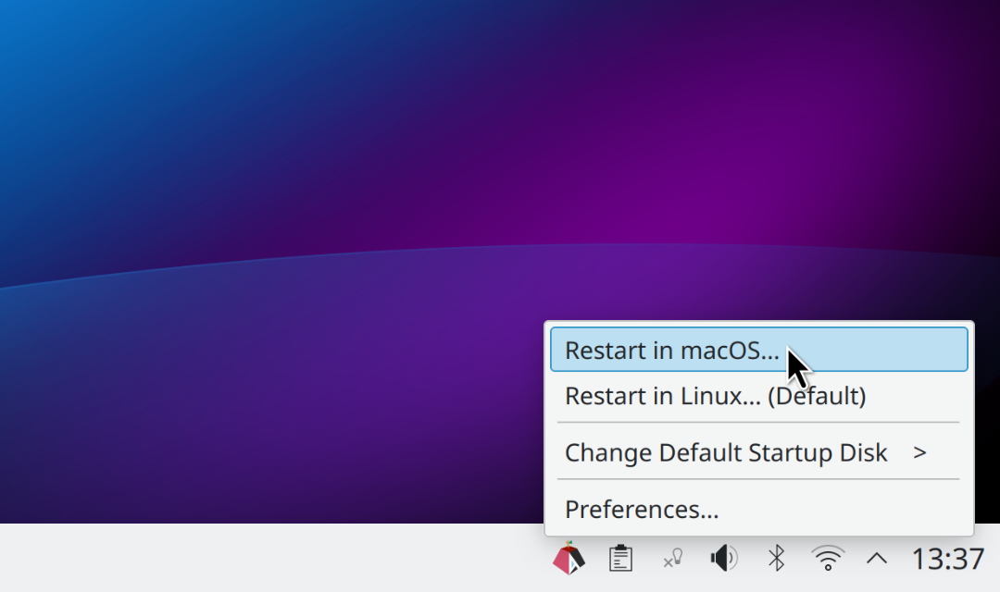

```diff
- FIXME: We're considering 4 different UI options
- and can't decide which one is best.
```

**Option B (THIS README)**: Essentially the same as [Option A](./README_OPTION_A.md),
but with an additional optional checkbox menu item
that allows users to **CHANGE** the default 'Startup Disk' upon restarting.

How it differs from **Option A** README:

```diff
- slightly different mock screenshot (todo)
- (an optional toggle to always change the default 'Startup Disk' setting when restarting)
- Preferences dialog to e.g. enable/disable the toggle above (by default, restarting doesn't always change the default 'Startup Disk')
- Restarting only changes the default 'Startup Disk' setting if you *want* it to change.
- **Doesn't Force Startup Disk Change**: Current default Startup Disk setting will not change unless you *want* to change it.
- The application was designed to not **force** changing the default 'Startup Disk' setting when switching to the other OS,
```
- See the [main README](./README.md) for the other options

---

# Asahi Restart Helper<br>(Linux version)

<br>
```diff
- todo: update mock screenshot to include the "OPTION B optional toggle"
```

***A faster alternative to the "hidden" Apple silicon Boot Menu.***

**Asahi Restart Helper (Linux version)** makes it easy for [Asahi Linux](https://asahilinux.org/) users to
restart the computer into macOS.

**NOTE: You should also install the
[corresponding macOS version](https://github.com/rxhfcy/Asahi-Restart-Helper--macOS-version),<br>
to make it equally easy to return back to Linux from macOS!**

## Usage

Click the system tray icon and select the OS you want to restart into:

- **Restart in macOS**: Restart and load **macOS** this time.
- **Restart Linux**: or Restart *back into Linux*, regardless of the current 'Startup Disk' setting.
- (An optional toggle to always change the default 'Startup Disk' upon restarting)

Or use the other menu items:

- **Change default 'Startup Disk'**: Use this submenu if you want to change the default 'Startup Disk' setting.
- **Preferences**: This dialog allows you to to e.g. enable/disable the toggle above (by default, restarting doesn't always change the default 'Startup Disk').

Restarting only changes the default 'Startup Disk' setting if you *want* it to change.

The 'Startup Disk' determines the operating system the computer always loads by default after shutting down,
or after restarting "normally" without using this application.

The current default is indicated in the menu with a "(current default)" label.

## Features

- **Fast and Easy to Use**: Just click the icon and select the OS you want to use next.
- **Doesn't Force 'Startup Disk' Change**: Current default 'Startup Disk' setting will not change
  unless you *want* to change it.
- **Same Boot Menu GUI on Both macOS and Linux**: Use the same GUI on both operating systems by
  also installing the corresponding
  [macOS version](https://github.com/rxhfcy/Asahi-Restart-Helper--macOS-version) on macOS.

## Who should use it and why?

Beginners and expert users alike benefit from using this application. It simplifies dual-booting Linux and macOS on Apple Silicon Macs. Apple's native boot menu is "hidden" on start-up, hard to access, and slow to use, leaving room for improvement. The application fills this gap by offering a more convenient "OS picker" or "boot menu".

Apple has intentionally made it difficult to use any OS other than macOS. This project aims to mitigate the friction caused by Apple's design decisions when using two or more operating systems on the computer.

Because Apple decided to not allow showing the boot menu on start-up, they also had to introduce the somewhat confusingly named concept of the 'Startup Disk', which determines the default OS that is always loaded after shutting down the computer or restarting it "normally" using the native OS restart functionality. This application also simplifies restarting into Linux itself, even if macOS happens to currently be set as the 'Startup Disk'.

## Screenshots

<br>
Click the icon, then select "Restart in macOS..." to restart and load macOS.

```diff
- todo: update mock screenshot to include the "OPTION B optional toggle"
- [✔️] Always change default Startup Disk
- (before "Change Default Startup Disk")
```

(TODO: is it necessary to add another screenshot here, e.g. using the submenu to change the Default only?<br>
       ...or add a separate screenshot page, also showing the preferences? Hopefully not necessary?)

## Installation

**NOTE: In the future, if all goes to plan, the installation will be handled
        automatically when you install Asahi Linux, and these steps will become unnecessary.**

First, install the necessary dependencies in the terminal:

```bash
sudo dnf install git gcc make pkg-config gtk3-devel asahi-bless
```

Next, `git clone` this repository and navigate to the directory in your terminal:

```bash
git clone https://github.com/rxhfcy/Asahi-Restart-Helper--Linux-version.git
cd Asahi-Restart-Helper--Linux-version
```

Build and install:
```bash
make
sudo make install
```

## Notes for GNOME users only

**NOTE: In the future, if all goes to plan, GNOME users will also have this application installed in a usable state
        by default after installing Asahi Linux, and this note will become obsolete.**

The application's system tray icon displays correctly on KDE Plasma.

However, if you choose to use GNOME, you must also install and enable
[this extension](https://extensions.gnome.org/extension/615/appindicator-support/) to display system tray icons,
a feature that is not natively supported by GNOME.

If the tray icon appears incorrectly with a green tint, open the Extension Manager,
go to the preferences for `AppIndicator and KStatusNotifierItem Support`
and set the brightness to the maximum value (1.0)

## Technical overview

This application provides a GUI that replaces the "hidden" native boot menu
by running the `asahi-bless` command with the `--next` argument.
This adds a temporary NVRAM parameter (`alt-boot-volume`) for this restart only,
leaving the default 'Startup Disk' setting (the `boot-volume` NVRAM parameter) unchanged
unless the user explicitly modifies it using the submenu.

The application was designed to
not force changing the default 'Startup Disk' setting when switching to the other OS,
because this can arguably prevent confusion for users who don't want to have to always keep track of the current default setting
after shutting down the computer (i.e. to make it more predictable which OS will load after starting up the computer in that case).
It is arguably best to use whichever OS is used more frequently as the default Startup Disk,
instead of continuously changing it for little reason, which can make the 'Startup Disk' setting itself feel almost random and useless.

When exactly two bootable disks are detected, the current disk is always displayed as "Linux" in the menu,
and the other disk is assumed to be the "macOS" disk.
If three or more disks are detected, and exactly one of the disks is named "Macintosh HD",
that disk is assumed to be the main "macOS" disk.
Any other disks are listed in the menu using their full disk names in this case.

## Requirements
- Apple silicon Mac (Asahi Linux is ARM64-only)
- Both Asahi Linux and macOS must be installed on the computer

## Contributing

Contributions are welcome! Please open a new issue or pull request.

## License

This project is licensed under the [MIT License](./LICENSE).

## Project goals

The ultimate goal of this project is to have the icon installed by default (both on Linux and macOS) automatically after the user installs Asahi Linux, to make "dual-booting" between macOS and Linux easier, especially for Asahi newbies.

- **Linux System Tray icon**: The goal is to convince Asahi Linux distributions (Fedora Asahi Remix, others?) 
  to automatically install the Linux version of this application (add the icon in Linux/KDE System Tray)
  - Also install a GNOME extension that allows showing the System Tray icon
   on GNOME?
- **macOS menubar icon**: The goal is to convince the Asahi Linux installer to automatically install
  the macOS version of this application (add the icon in macOS menubar)
- **Rationale**: This would benefit all users, especially Asahi beginners who e.g. don't already know the
  correct "arcane spell" to switch to macOS from Linux (`sudo dnf install asahi-bless && sudo asahi-bless`)

# See also: [TODO.md](./TODO.md)

