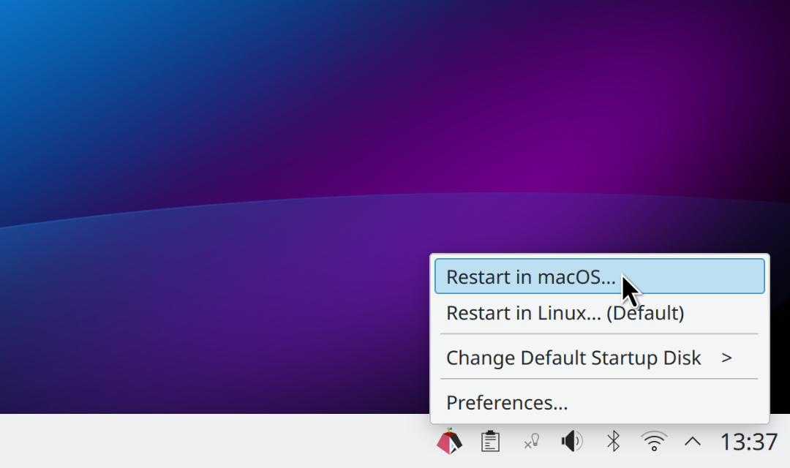

```diff
- FIXME: We're considering 4 different UI options
- and can't decide which one is best.
```

**"Perhaps TOO Simple" Option X (THIS README)**: This option **ONLY** offers a
"Restart in macOS..." option.
This will **ALWAYS CHANGE** the default 'Startup Disk' to macOS (imitates Apple's Boot Camp behavior).
It **DOES NOT** provide a submenu to change the default 'Startup Disk' back to Linux.

- See the [main README](./README.md) for the other options

___

# Restart in macOS (system tray icon)<br>

<br>

***The simple way to restart your Apple silicon Mac using macOS.***

Easily 
load your existing macOS installation (from [Asahi Linux](https://asahilinux.org/)).

**NOTE: You should also
[install the corresponding macOS app ("Restart in Linux")](https://github.com/rxhfcy/Asahi-Restart-Helper--macOS-version)
,<br>
to make it equally easy to return back to Linux after using macOS!**

## Usage

Click the system tray icon and choose this menu item:

- **Restart in macOS**: Restart and load **macOS**.   
  - Changes the default 'Startup Disk' to macOS.
  - To return to Linux later:
    - use ["Restart in Linux"](https://github.com/rxhfcy/Asahi-Restart-Helper--macOS-version) on macOS,
    - or change the 'Startup Disk' setting.

Or change the preferences:

- **Preferences**: This dialog allows you to enable showing the icon after logging in, or to set up password-free usage.

Using **Restart in macOS** always changes the default 'Startup Disk' setting.

The 'Startup Disk' determines the operating system the computer always loads by default after shutting down
or restarting.

## Features

- **Fast and Easy to Use**: Just click the icon and choose "Restart in macOS".
- **Always Changes 'Startup Disk' Setting**: Shutting down or restarting the computer
  always returns back to the OS last used.
  Change the default back to Linux on macOS by using
  ["Restart in Linux"](https://github.com/rxhfcy/Asahi-Restart-Helper--macOS-version),
  or by otherwise changing the 'Startup Disk' setting.
- **Same icon on Both macOS and Linux**: Use the same GUI on both operating systems by
  also installing the
  [corresponding macOS version](https://github.com/rxhfcy/Asahi-Restart-Helper--macOS-version) on macOS.

## Who should use it and why?

Beginners and expert users alike benefit from using this application's
[corresponding macOS version](https://github.com/rxhfcy/Asahi-Restart-Helper--macOS-version) on macOS.
Using them simplifies dual-booting Linux and macOS on Apple Silicon Macs.

Apple has intentionally made it difficult to use any OS other than macOS. This project aims to mitigate the friction caused by Apple's design decisions when using two or more operating systems on the computer.

Because Apple decided to not allow showing the boot menu on start-up,
they also had to introduce the somewhat confusingly named concept of the 'Startup Disk',
which determines the default OS that is always loaded after shutting down the computer or restarting it.
This application changes that default "temporarily" to macOS, until it is changed back to Linux by
either using ["Restart in Linux"](https://github.com/rxhfcy/Asahi-Restart-Helper--macOS-version),
or via System Settings / Startup Disk.

## Screenshots

<br>
Click the icon, then select "Restart in macOS..." to restart and load macOS.

```diff
- FIXME: update mock screenshot
- to ONLY show "Restart in macOS..."!
```

## Installation

**NOTE: In the future, if all goes to plan, the installation will be handled
        automatically when you install Asahi Linux, and these steps will become unnecessary.**

First, install the necessary dependencies in the terminal:

```bash
sudo dnf install git gcc make pkg-config gtk3-devel asahi-bless
```

Next, `git clone` this repository and navigate to the directory in your terminal:

```bash
git clone https://github.com/rxhfcy/Asahi-Restart-Helper--Linux-version.git
cd Asahi-Restart-Helper--Linux-version
```

Build and install:
```bash
make
sudo make install
```

## Notes for GNOME users only

**NOTE: In the future, if all goes to plan, GNOME users will also have this application installed in a usable state
        by default after installing Asahi Linux, and this note will become obsolete.**

The application's system tray icon displays correctly on KDE Plasma.

However, if you choose to use GNOME, you must also install and enable
[this extension](https://extensions.gnome.org/extension/615/appindicator-support/) to display system tray icons,
a feature that is not natively supported by GNOME.

If the tray icon appears incorrectly with a green tint, open the Extension Manager,
go to the preferences for `AppIndicator and KStatusNotifierItem Support`
and set the brightness to the maximum value (1.0)

## Technical overview

This application provides a GUI to easily restart the computer using macOS.
It works by running the `asahi-bless` command.
This changes the default 'Startup Disk' setting (the `boot-volume` NVRAM parameter).

The application was designed to
always change the default 'Startup Disk' setting when switching to macOS,
because this can arguably prevent confusion for users
who always want shutting down and restarting the computer to return back to the last OS used.
However, this also means that to get back to Linux,
the user has to change the default 'Startup Disk' setting back to "Linux".

When exactly two bootable disks are detected, the current disk is of course "Linux",
and the other disk is assumed to be the "macOS" disk.

## Requirements
- Apple silicon Mac (Asahi Linux is ARM64-only)
- Both Asahi Linux and macOS must be installed on the computer

## Contributing

Contributions are welcome! Please open a new issue or pull request.

## License

This project is licensed under the [MIT License](./LICENSE).

## Project goals

The ultimate goal of this project is to have the icon installed by default (both on Linux and macOS) automatically
after the user installs Asahi Linux.

- **Linux System Tray icon**: The goal is to convince Asahi Linux distributions (Fedora Asahi Remix, others?) 
  to automatically install the Linux version of this application (add the icon in Linux/KDE System Tray)
  - Also install a GNOME extension that allows showing the System Tray icon
   on GNOME?
- **macOS menubar icon**: The goal is to convince the Asahi Linux installer to automatically install
  the macOS version of this application (add the icon in macOS menubar)
- **Rationale**: This would benefit all users, especially beginners who e.g. don't already know the
  correct "arcane spell" to switch to macOS from Linux (`sudo dnf install asahi-bless && sudo asahi-bless`)

# See also: [TODO.md](./TODO.md)

